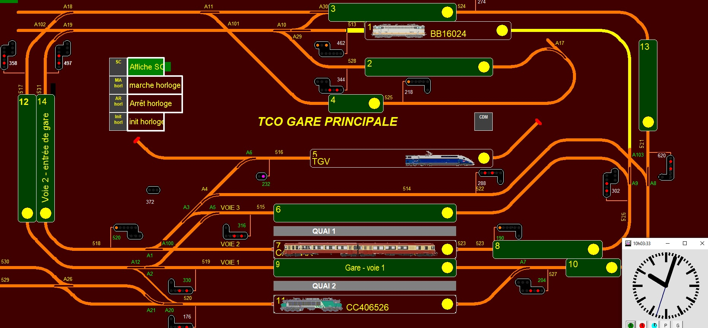

Signaux_complexes_GL
====================

Client signaux complexes pour CDM rail ou centrales pilotées par XpressNet
en USB ou Ethernet.
Fichiers sources. 

Signaux_complexes_GL est client de CDM rail mais fonctionne aussi de façon autonome si vous disposez d'une centrale compatible Xpressnet. Il pilote les signaux complexes belges et français de façon automatique de votre réseau après modélisation (il existe une importation automatique du réseau CDM rail).
Il permet également de piloter des fonctions F de locomotives, jouer des sons et actionner des passages à niveaux à plusieurs voies d'après des actionneurs, piloter des périphériques via port COM/USB (ex=Arduinos) et Socket réseau.
Il gère des TCOs et peut lancer CDM rail automatiquement avec votre LAY et l'interface choisie. 

Ce logiciel nécessite une installation : faire clic droit en sélectionnant "exécuter en tant qu'administrateur" sur installeur.exe.
Vous pouvez voir les nouveautés de chaque version dans le fichier versions.txt.

== Liens ==

:lien: http://cdmrail.free.fr/ForumCDR/viewtopic.php?f=77&t=3906#p50499
:cdm:  http://cdmrail.free.fr/SiteCDR/index.html
:release:  https://github.com/f1iwq2/Signaux_complexes_GL/releases

* {lien}[Lien vers le fil] -- Forum de CDM rail
* {cdm}[Lien vers CDM rail] -- Site de CDM rail  
* {release}[Lien vers le téléchargement, choisir signaux_complexes_VX.X.zip] -- Lien vers téléchargement

